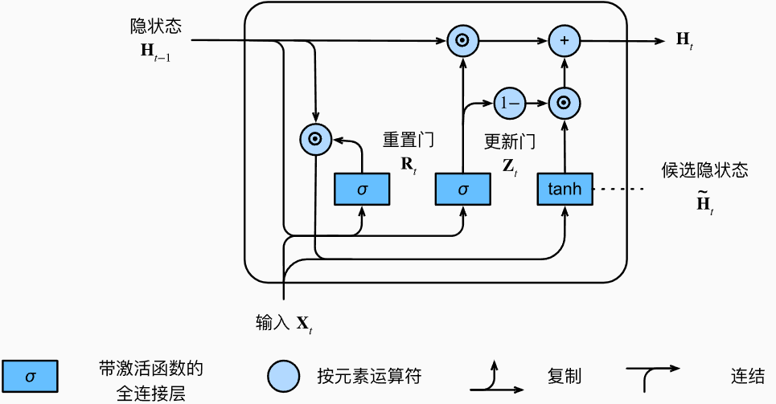
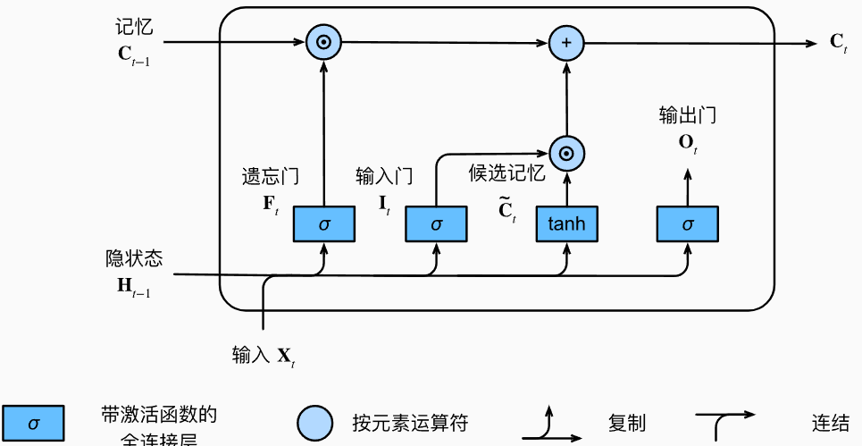

<h1 align='center'> 长短期记忆模型 -- LSTM </h1>

## 一. 提出背景
简单的rnn在应用中会有许多缺陷:
- 不支持**长期依赖(Long-term Dependeny)**, `The animal didn't cross the street because it was too tired.`中的`it`指的是`animal`, 但是由于相距过长 (时间步较长), *梯度消失*使得简单rnn很难记住这个关系
- **序列数据的一些词元没有观测值**(和目标无关), rnn无法跳过. 对网页内容情感分析时, 一些辅助HTML代码与网页内容传达的情绪无关, 能否**有一些机制来跳过隐状态表示中的此类词元**
- ...

综上, 引入**门控机制**, 网络能够通过专门的门控来决定隐状态的更新和重置(信息的忘记与保留). 例如, 如果第一个词元非常重要, 模型将学会在第一次观测之后不更新隐状态. 同样, 模型也可以学会跳过不相关的临时观测. 最后, 模型还将学会在需要的时候重置隐状态。

## 二. "后提出,更简单"的门控网络 -- GRU
*学习LSTM之前, 先学习较简单的门控循环单元(Gated recurrent unit), 便于理解门控机制*

### 1. 结构总览
$sigmoid$函数值区间为$(0, 1)$, 有"比例"的作用, 可以用做阀门 
[门的值要与把关的数据做Hadamard乘($\odot$)]
  

### 2. 数学表达
对于给定的时间步$t$，假设输入是一个小批量$X_t \in R^{n \times d}$（样本个数$n$，输入个数$d$），上一个时间步的隐状态是$H_{t-1} \in R^{n \times h}$（隐藏单元个数$h$）。
那么，重置门$R_t \in R^{n \times h}$和更新门$Z_t \in R^{n \times h}$的计算如下所示：

$$
\begin{aligned}
R_t = \sigma(X_t W_{xr} + H_{t-1} W_{hr} + b_r)\\
Z_t = \sigma(X_t W_{xz} + H_{t-1} W_{hz} + b_z)
\end{aligned}
$$

进而计算**候选隐状态**$\~H$:
$$
\tilde{H}_t = \tanh\left(X_t W_{xh} + \left(R_t \odot H_{t-1}\right) W_{hh} + b_h\right)
$$
与简单rnn的 *cell处理* 对比, $R_t$与$H_{t-1}$相乘可以减少以往状态的影响, 每当重置门$R_t$中的项接近1时, 即为简单的rnn; 对于$R_t$中所有接近0的项, 候选隐状态可以看作$X_t$作为输入的MLP的结果, 即清空了以前的记忆.

接下来利用**更新门**$Z_t$得到真正的**隐状态**$H_t$:
$$
H_t = Z_t \odot H_{t-1} + (1 - Z_t) \odot \tilde{H}_t
$$
[$H_{t-1}$表示上一个时间步的隐状态], 每当更新门$Z_t$接近1时, 模型**倾向于只保留旧状态$H_{t-1}$**, 此时来自$X_t$的信息基本被忽略

### 3. 门的理解
GRU 用到了两个门:
- *重置门(reset gate)*: 控制"可能还想起"的过去状态的数量;
- *更新门(update gate)*: 控制新状态中有多少个是旧状态的副本.

重置门和更新门各司其职。重置门单方面控制自某个节点开始，之前的记忆（隐状态）不在乎了，*直接清空影响*，同时也需要更新门帮助它实现记忆的更新。更新们更多是用于*处理梯度消失问题*，可以选择一定程度地保留记忆，防止梯度消失。
- *重置门*有助于捕获序列中的**短期依赖**关系;
- *更新门*有助于捕获序列中的**长期依赖**关系.

## 三. 长短期记忆模型 -- LSTM

LSTM引入了*记忆元(memory cell)*, 记忆元是隐状态的一种特殊类型
为了控制记忆元, 需要很多门: 
- *输出门(output gate)* 从单元中输出记忆元的tanh的门控版本;
- *遗忘门(forget gate)* 用于重置单元的内容; 
- *输入门(input gate)* 用于控制写入多少新数据

### 1. 结构

### 2. 数学表达
假设有$h$个隐藏单元, 批量大小是$n$, 输入数为d.
输入$X_t \in R^{n \times d}$, 前一时间步的隐状态为$H_{t-1} \in R^{n \times d}$, 三个门的值为:
$$
\begin{aligned}
I_t = \sigma \left(X_t W_{xi} + H_{t-1} W_{hi} + b_i \right) \\
F_t = \sigma \left(X_t W_{xf} + H_{t-1} W_{hf} + b_f \right) \\
O_t = \sigma \left(X_t W_{xo} + H_{t-1} W_{ho} + b_o \right)
\end{aligned}
$$
候选记忆元类似简单rnn在某一时间步的输出:
$$
\~C_t = \tanh \left( X_t W_{xc} + H_{t-1} W_{hc} + b_c\right)
$$
最后新的记忆元$C_t$计算为通过遗忘门和输入门的数据总和:
$$
C_t = F_t \odot C_{t-1} + I_t \odot \~C_t
$$
输出门的作用就是计算隐状态$H_t \in R^{n \times h}$, 该隐状态会传递到输出层:
$$
H_t = O_t \odot \tanh(C_t)
$$
这里的$\tanh$用于将$C_t$的值重新映射到$(-1, 1)$, 只要输出门接近1, 我们就能够有效地将所有记忆信息传递给预测部分, 而对于输出门接近0, 我们只保留记忆元内的所有信息, 而不需要更新隐状态.

### 3. 门的理解
LSTM循环网络中, 可以把记忆元$C$这条看作是**一本"日记本"的更新**, 将**遗忘门$F_t$视作是"橡皮"**, 他能够"擦除"过去$C_{t-1}$上过去的一部分; 可以将**输入门$I_t$视作是"铅笔"**, 他控制要把多少新的内容$ \~C_t $写到笔记本上.

## 四. LSTM的BPTT, 缓解梯度消失
对于LSTM的相关公式:
$$
\begin{cases}
F_t = \sigma\left(W_{xf}X_t + U_{hf}H_{t-1} + b_f\right) \\
I_t = \sigma\left(W_{xi}X_t + U_{hi}H_{t-1} + b_i\right) \\
O_t = \sigma\left(W_{xo}X_t + U_{ho}H_{t-1} + b_o\right) \\
\tilde{C}_t = \tanh\left(W_{xc}X_t + U_{hc}H_{t-1} + b_c\right) \\
C_t = F_t \odot C_{t-1} + I_t \odot \tilde{C}_t \\
h_t = O_t \odot \tanh\left(C_t\right)
\end{cases}
$$
链式法则推导参数偏导时, 会出现$\prod_{j=k+1}^t \frac{\partial C_j}{\partial C_{j-1}}$这样的偏导, 有上面公式可知,
$$
\frac{\partial C_j}{\partial C_{j-1}} = F_t
$$
**详细推导过程可以看[b站视频](https://www.bilibili.com/video/BV1fF411P72y)
因为$F_t = \sigma(...)$, 所以$F_t$的范围是$(0, 1)$
实际中, $F_t \approx 1$, 故**连乘后几乎不衰减**.