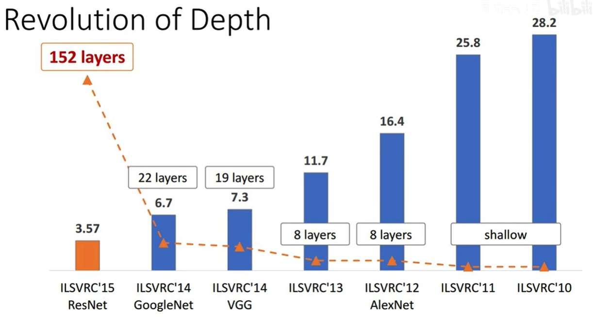
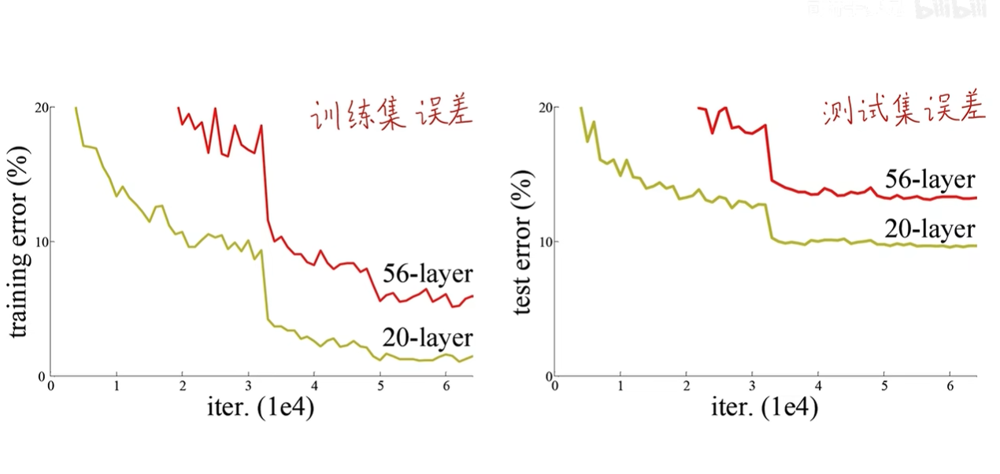
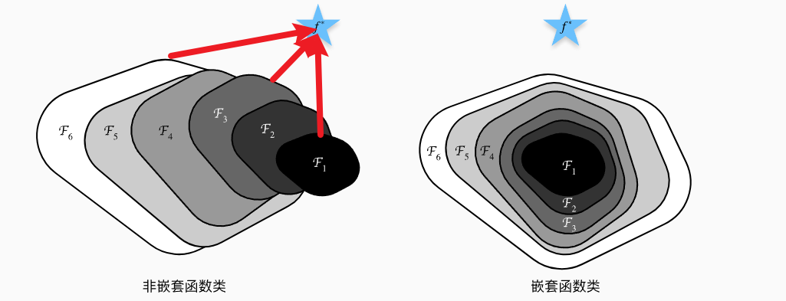
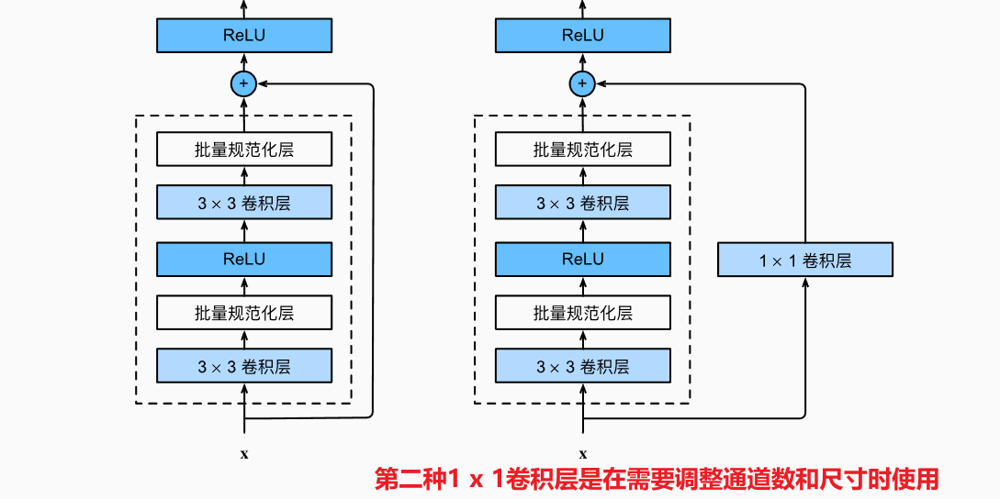
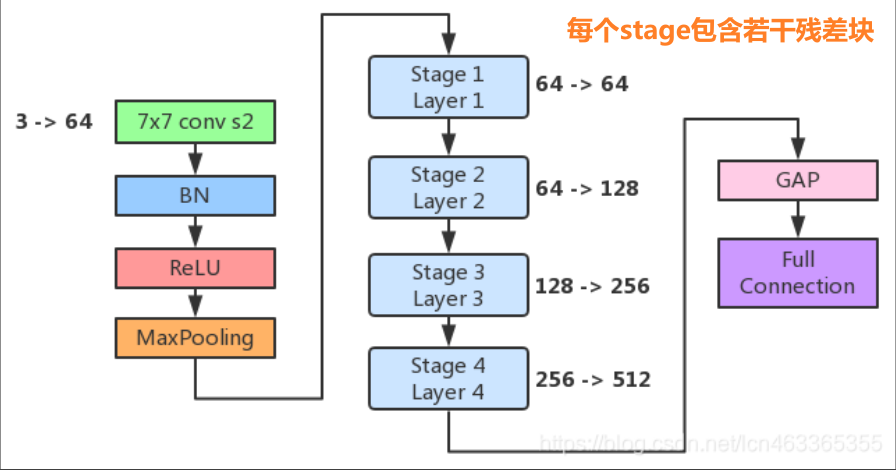

<h1 align='center'>残差连接神经网络 --- ResNet </h1>

**实现了"更深的层"**


## 一. 背景 --- 网络退化现象(degradation problem)
> 既不是梯度消失(loss不会降), 也不是梯度爆炸, 也不是过拟合(测试集误差高)

**网络退化现象是指**: 理论上来说, 更深的网络模型表现力更好, 然而实际研究表示, 更深的网络反而表现力下降




## 二. 残差学习
神经网络的本质就是在做**函数拟合**, 要学习(拟合)函数$H(x)$.
在**深度**网络中, 很多层应该做**恒等映射(identity mapping)**: 
$$
H(x) \approx x
$$
这样才能使得深的网络不会比浅的网络表现还差

**残差网络的核心思想**：每个附加层都应该更容易地包含原始函数作为其元素之一

### 1. 残差学习
**传统的网络(如 VGG)** 是在直接拟合完整函数$H(x)$, 而在ResNet中, 网络把需要拟合的函数变成:
$$
H(x) = x + F(x) \\
(其中: F(x) = H(x) - x)
$$
这里的x可以视为**前面的较浅较小网络的成果**
残差学习并不是直接拟合$H(x) \approx x$, 而是拟合残差$F(x) \approx 0$

> 对于深度神经网络, 如果我们能将新添加的层训练成**恒等映射(identity function)$H(x)=x$**, 新模型和原模型将同样有效(即使残差没有学到东西). 同时, 由于新模型可能得出 **更优的解(使用残差进行微调)** 来拟合训练数据集，因此添加层似乎更容易降低训练误差。


### 2. 残差映射更容易优化


## 三.残差块(Resduial Block)设计
残差块的输入到输出有两条路:
1. 残差学习
`Conv3 -> BN -> ReLU -> Conv3 -> BN`
2. 恒等映射(identity mapping/shortcut connection/skip connection)

最后两个通道**相加运算**[要保证分辨率相同]


```python
class Residual(nn.Module):
    """一个残差块"""
    def __init__(self, input_channels, num_channels,
                 use_1x1conv=False, strides=1):
        """
        kernel_size=3, padding=1
        strides = 2时, 尺寸减半

        use_1x1conv用于需要调整通道数时时
        """
        super().__init__() 
        self.conv1 = nn.Conv2d(input_channels, num_channels,
                                kernel_size=3, padding=1, stride=strides)
        self.conv2 = nn.Conv2d(num_channels, num_channels,
                                kernel_size=3, padding=1, stride=1)
        if use_1x1conv:
            self.conv3 = nn.Conv2d(input_channels,num_channels,
                                   kernel_size=1, stride=strides)

        else:
            self.conv3 = None

        self.bn1 = nn.BatchNorm2d(num_channels)
        self.bn2 = nn.BatchNorm2d(num_channels)
        
    def forward(self, x):
        Y = F.relu(self.bn1(self.conv1(x)))
        Y = self.bn2(self.conv2(Y))
        if self.conv3: # 恒等映射
            x = self.conv3(x)
        Y += x  # in-place
        return F.relu(Y)
```

## 四. ResNet结构剖析

1. ResNet的前两层和GoogleNet一样, 只是多了BN(避免梯度消失和爆炸)
`Conv7 -> BN -> ReLU -> MaxPool(步幅为2)` 
2. 后面为4个由残差块组成的模块构成, 每个stage使用若干个同样输出通道数的残差块 
每个模块的第一个残差块会将上一个模块的通道数翻倍(第一个除外).

```python
def resnet_block(input_channels, num_channels, num_residuals,
                first_block=False):
    """
    返回一个包含若干个残差块的列表
    """
    blk = []
    for i in range(num_residuals):
        if i == 0 and not first_block:
            blk.append(Residual(input_channels, num_channels,
                                use_1x1conv=True, strides=2))
        else:
            # 第一个模块不需要调整通道数和尺寸减半
            blk.append(Residual(num_channels, num_channels))

    return blk

b1 = nn.Sequential(nn.Conv2d(1, 64, kernel_size=7, stride=2, padding=3),
                   nn.BatchNorm2d(64), nn.ReLU(),
                   nn.MaxPool2d(kernel_size=3, stride=2, padding=1))
b2 = nn.Sequential(*resnet_block(64, 64, num_residuals=2, first_block=True))
b3 = nn.Sequential(*resnet_block(64, 128, num_residuals=2))
b4 = nn.Sequential(*resnet_block(128, 256,num_residuals=2))
b5 = nn.Sequential(*resnet_block(256, 512, num_residuals=2))

net = nn.Sequential(b1, b2, b3, b4, b5,
                    nn.AdaptiveAvgPool2d((1, 1)),
                    nn.Flatten(), nn.Linear(512, 10))
```