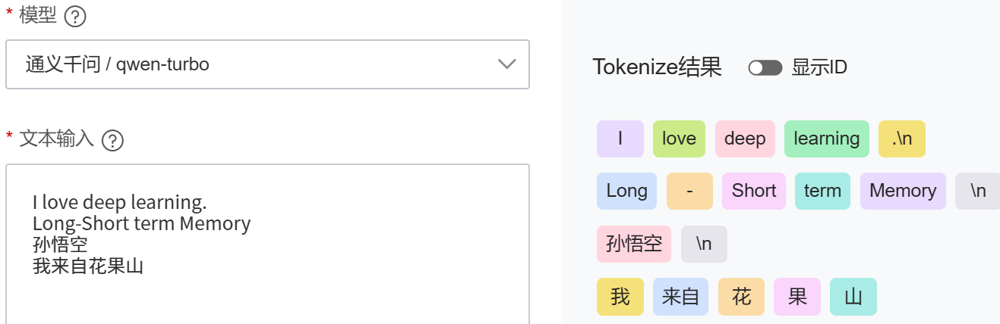
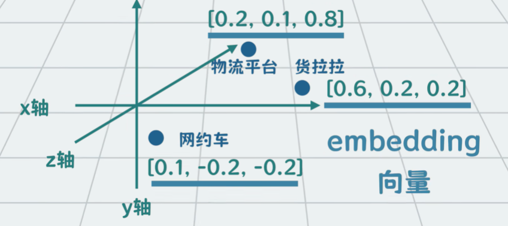

<h1 align='center'> 自然语言处理 (NLP) 入门 </h1>

在开始rnn这些语言模型时, 对基本的序列信息, 语言模型的数据集形式缺乏认知, 故在此进行一些 NLP 有关的入门学习

## 一. 语言模型的数据形式

### 1. 原始数据
原始数据就是文本, 比如`I love deeping learning`, 或者是一篇文章`deepinglearn.txt`:
```txt
I love machine learning
Deep learning is powerful
Natural language processing is interesting
```

### 2. 文本 --> 数字序列
语言模型对文本的第一个**预处理**是--**分词(Tokenization)**


可以将`I love deep learning`分为**若干个词元(token)**:
```python
["I", "love", "deep", "learning"]
```
通过给每个词分配id, 就能建立词表, 进行文本句子就变成数字序列:
```python
[1, 2, 3, 4]
```

### 3. Embeding (词向量)
**Word Embedding**就是为了解决one-hot编码的缺陷, 其用一个向量来对一个词进行表示. 具有很强的表达关联特征的能力
输入token id后, 还要转向量 [$token \in R^n 转为 vector \in R^{n \times d} $]:

Embedding层最终完成的工作：
1. 将稀疏矩阵 (one-hot) 经过线性变换（查表）变成一个密集矩阵
2. 这个密集矩阵用了**N个特征(`embeddings_dim`)来表示所有的词**。密集矩阵中表象上是一个词和特征的关系系数，实际上蕴含了大量的词与词之间的内在关系。
3. 它们之间的权重参数，用的是**嵌入层学习来的参数**进行表征的编码。在神经网络反向传播优化的过程中，这个参数也会不断的更新优化。

```python
self.embedding = nn.Embedding(num_embeddings=vocab_size, embedding_dim=embedding_dim)
# embedding层暗含权重矩阵形状为(num_embeddings, embeddings_dim)
# 他能将接收的输入的每一个token变换成一个word vector
# (batch, seq_len) ==> (batch, seq_len, embedding_dim)
```
embedding内部的可学习矩阵$shape = (vocab\_size, embedding\_dim)$, 意思是词表(vocab)的每一个token id都有$embedding\_dim$个特征

## 二. 语言模型(LM)的任务
语言模型的目标就是根据前面的文本去**预测下一个词**
假设长度为$T$的文本序列中的词元依次为$x_1, x_2, ..., x_T$, $x_t (1 \leq t \leq T)$, $x_t$可以认为是**文本序列在时间步$t$处的观测或标签**, 在给定这样的文本序列时, *语言模型(LM)*的目标就是**估计**序列的联合概率:
$$
P(x_1, x_2, ..., x_T)
$$

### 1. 训练数据
- 输入: 
`[1, 2, 3]`
- 目标(target):
`[2, 3, 4]`

1) **RNN 的`next-token prediction`**
```text
t=1: input=I        predict=love
t=2: input=love     predict=deep
t=3: input=deep     predict=learning
```

2) **实际的batch数据**
```text
sentence1: I love deep learning
sentence2: deep learning is fun

token:
[1,2,3,4]
[3,4,5,6]
```

3. batch训练
```text
输入:              目标:
[[1,2,3],          [[2,3,4],
 [3,4,5]]           [4,5,6]]
```

### 2. 不同NLP任务的数据形式
| 任务   | 输入    | 输出   |
| :--: | ----- | ---- |
| 语言模型 | 单词序列  | 下一个词 |
| 情感分析 | 句子    | 正/负  |
| 机器翻译 | 英文句子  | 中文句子 |
| 问答   | 问题+文章 | 答案   |


### 3.一个关键理解
RNN的**本质建模**就是:
$$
P(x_t | x_1 ... x_{t-1})
$$
这适用于各种序列数据:
| 数据 | 序列  |
| -- | --- |
| 文本 | 单词  |
| 语音 | 声音帧 |
| 股票 | 时间点 |
| 视频 | 图像帧 |

1. NLP 数据本质就是整数序列: 
`[35, 81, 9, 104, 6]`
2. 模型的任务就是:
**`predict next number`**
3. 这些数字背后的代表:
`words, 时间点, 图像帧, ...`