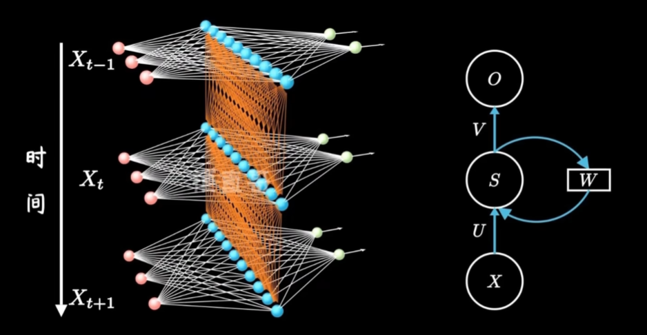
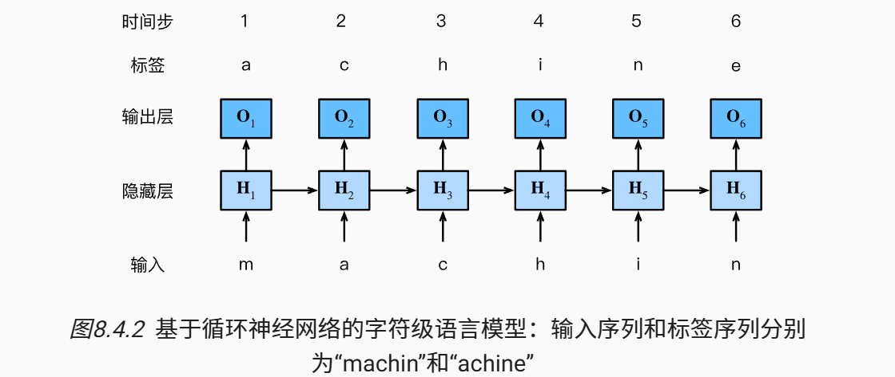
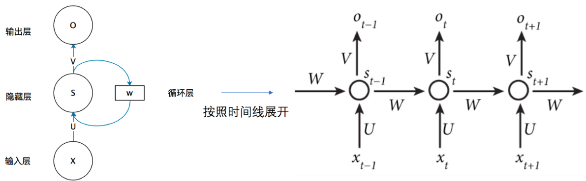
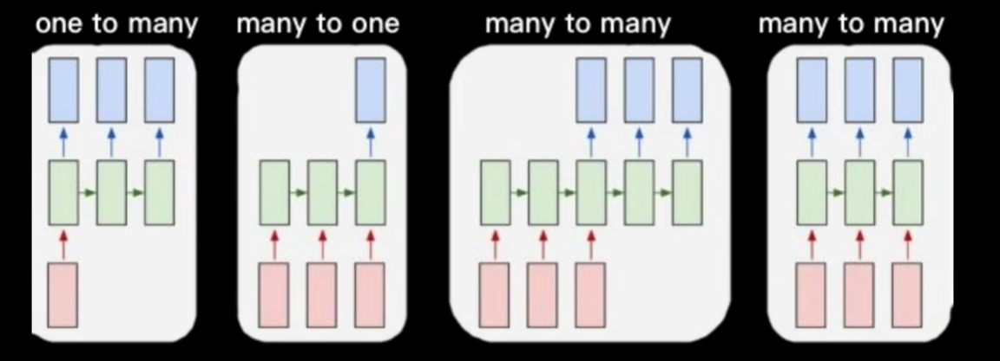

<h1 align='center'> 循环神经网络 --- rnn </h1>

## 一. 提出背景
现实中, 很多问题都是**序列问题**:
| 任务 | 数据形式 |
| :--: | ------ |
| 语言模型 | 单词序列 |
| 机器翻译 | 句子 |
| 语音识别 | 声音时间序列 |
| 股票预测 | 时间序列 |

### 1. 对记忆的要求
**MLP**和**CNN**, 这些网络工作时, 只会接收一个输入, 然后经过隐藏层, 得到特定的输出, 基本就是在拟合函数$y=f(x)$, 他们所处理的输入之间是没有关系的, 只会一个一个的处理输入, 之前的某个输入不会对现在输入的处理产生影响

但是对于序列问题而言, 序列**前后数据之间的关系是密切的**(上下文, 视频前后帧, **词性标注**问题, 时序信息), 为了解决一些这样类似的问题, 能够更好的处理序列的信息, RNN就诞生了。

>假设长度为$T$的文本序列中的词元依次为$x_1, x_2, ..., x_T$, $x_t (1 \leq t \leq T)$, $x_t$可以认为是**文本序列在时间步$t$处的观测或标签**, 在给定这样的文本序列时, *语言模型*(LM) 的目标就是**估计**序列的联合概率:
$$
P(x_1, x_2, ..., x_T)
$$

### 2. 非固定的输入长度
普通的CNN, MLP处理的都是**固定长度的输入**, 但对于序列数据尤其是时间序列而言, 输入长度是很不固定的, 这就使得原有的网络无法有效的处理

## 二. 具有隐状态的网络 --- rnn
RNN 可以视作在普通的MLP的基础上, 建立了时间轴上隐藏层之间的联系, 这样随着时间进行依次输入序列数据时, 每次的输出都与**当期输入和上一期的隐藏层状态有关**, 这里的上一期隐藏层状态便代表的是"记忆"


U是输入层到隐藏层的权重矩阵; O也是一个向量, 它表示输出层的值; V是隐藏层到输出层的权重矩阵.
W则是代表**隐藏层上一期的值**作为这一期的输入之一的权重, 实际中, 一个W是被时间轴上的所有rnn层共享的

这样, rnn的计算方法即为
$$
O_t = g(V \cdot S_t) \\
S_t = f(U \cdot X_t + W \cdot S_{t-1})
$$
相比于普通的Affine, 多了时间$t$下标和$W \cdot S_{t-1}$

## 三. rnn 构建语言模型
将文本token转为字符而不是单词, 建立**字符级语言模型**


### 困惑度 -- 评估语言模型的质量
一个更好的语言模型应该能让我们更准确地预测下一个词元. 我们可以通过一个序列中所有的个词元的**交叉熵损失的平均值**来衡量：
$$
\frac{1}{n} \sum_{t=1}^{n} -\log P(x_t \mid x_{t-1}, \dots, x_1)
$$
其中$P$有语言模型给出, $x_t$是在时间步$t$从该序列中*观察到的实际词元(label)*. 历史原因, 大家喜欢用**困惑度(perplexity)**, 即为上个式子的指数:
$$
\exp\left( -\frac{1}{n} \sum_{t=1}^{n} \log P(x_t \mid x_{t-1}, \dots, x_1) \right)
$$
困惑度的最好的理解是“下一个词元的实际选择数的调和平均数”
1. 在最好的情况下, 模型总是完美的估计标签词元的概率为1. 在这种情况下, 模型的困惑度为1.
2. 在最坏情况下, 模型总是预测标签词元的概率为0. 在这种情况下, 困惑度是正无穷大

> 具体的pytorch实现中, 词元采用**Embedding**词嵌入向量处理,利用官方模块的$CrossEntropyLoss$函数实现的计算为[vocab是词表]:
$$
loss = \frac{1}{n} \sum_{t=1}^{n} -\log P(x_t \mid x_{t-1}, \dots, x_1) \\
P(x_t \mid x_{t-1}, \dots, x_1) = \frac{\exp(O_n[x_t])}{\sum_{v=1}^{vocab\_size} \exp(O_n[v])} \ [即softmax]
$$


## 四. rnn反向传播
RNN 的训练采用**BPTT (Backpropagation Through Time)**, 思想是把按照时间线展开的 RNN 当作一个深层网络

由此, 能得到相关计算公式[$t$表示时间步, $S$是隐状态, $L$是该时间步预测的损失值]:
$$
\begin{cases}
O_t = \sigma(V \cdot S_t) \\
S_t = \sigma(U \cdot X_{t-1} + W \cdot h_{t-1}) \\
L_t = g(O_t)
\end{cases}
$$
根据链式法则, 可通过数学方法推得三个参数$U,W,V$的偏导[$V$的偏导简单, $W,U$结构一样]:
$$
\begin{cases}
\frac{\partial L_t}{\partial V} = \frac{\partial L_t}{\partial O_t} \frac{\partial O_t}{\partial V} \\
\frac{\partial L_t}{\partial W} = \sum_{k=1}^t \frac{\partial L_t}{\partial O_t} \cdot \frac{\partial O_t}{\partial h_t} \cdot \left( \prod_{j=k+1}^t \frac{\partial h_j}{\partial h_{j-1}} \right) \cdot \frac{\partial h_k}{\partial W} \\
\frac{\partial L_t}{\partial U} = \sum_{k=1}^t \frac{\partial L_t}{\partial O_t} \cdot \frac{\partial O_t}{\partial h_t} \cdot \left( \prod_{j=k+1}^t \frac{\partial h_j}{\partial h_{j-1}} \right) \cdot \frac{\partial h_k}{\partial U}
\end{cases}
$$
在这个偏导计算式中, $\prod_{j=k+1}^t \frac{\partial h_j}{\partial h_{j-1}}$部分要特别注意, 如果rnn用$tanh$作为激活函数, 那么可以得到:
$$
\frac{\partial h_j}{\partial h_{j-1}} = \tanh'\left(U \cdot X_j + W \cdot h_{j-1}\right) \cdot W
$$

### 简单rnn的缺陷
由于是连乘, 并且是$W, U$这两个权重都是时间步展开的 "各rnn层" 共享, 因此当**时间步过大**时, **简单rnn**会有如下问题的出现:
1. $\frac{\partial h_j}{\partial h_{j-1}} = \tanh' \left(U \cdot X_j + W \cdot h_{j-1}\right) \cdot W < 1$时
会有**梯度消失(Vanishing Gradient)**
2. $\frac{\partial h_j}{\partial h_{j-1}} = \tanh' \left(U \cdot X_j + W \cdot h_{j-1}\right) \cdot W > 1$时
会有**梯度爆炸(Exploding Gradient)**

## 五. rnn实现

### 1. `RNNCell`
这里的`SimpleRNNCell`的作用即为实现: $\tanh ( U \cdot X_t + W \cdot S_{t-1})$
```python
class SimpleRNNCell(nn.Module):
    def __init__(self, input_size, hidden_size):
        super().__init__()
        self.hidden_size = hidden_size
        self.Wx = nn.Linear(input_size, hidden_size)
        self.Wh = nn.Linear(hidden_size, hidden_size)

    def forward(self, x, h):
        h_new = torch.tanh(self.Wx(x) + self.Wh(h))

        return h_new
```

### 2. RNN
该实现中, 通过采用for循环将输入的sequence按照时间步拆开然后喂给一个全连接神经网络(Linear), 拆开的字符(或者单词)用词向量的形式表示, 即`(batch_size, embeddings_dim)`
```python
class MyRNN(nn.Module):
    def __init__(self, input_size, hidden_size):
        super().__init__()
        self.cell = SimpleRNNCell(input_size, hidden_size)

    def forward(self, x): # x.shape: (batch, seq, embed_dim)
        batch, seq, dim = x.shape
        h = torch.zeros(batch, self.cell.hidden_size).to(x.device)

        outputs = []

        for t in range(seq): # 按时间步展开, 实现"循环"
            x_t = x[:, t, :]    # x_t.shape = (batch, embeddings_dim)
            h = self.cell(x_t, h)
            outputs.append(h)

        outputs = torch.stack(outputs, dim=1) # 新增指定维度
        #outputs.shape: [(batch, hidden_size), (batch, hidden_size),...] ==> (batch, seq, hidden_size)
        return outputs, h
```

## 六. rnn的应用


### 1. 语言模型(Language Modeling)
语言模型就是要做到*根据前面的词预测下一个词*.
```text
输入:   I love deep
rnn预测:   learning
```

### 2. 文本生成(Text Generation)
算是语言模型的延伸应用: *给定一个开头, 自动写文章*

**生成流程**
```text
prompt -> RNN预测下一个词 -> 拼接 -> 再输入RNN -> 继续生成
```
**典型应用**
- 自动写诗, 写小说
- 对话系统 (早期)

### 3. 机器翻译 (Machine Translation)
是**seq2seq**序列到序列模型的经典应用

### 3. 语音识别 (Speech Recongnition)
*语音信号准成文本*
rnn发挥作用:
1. **语音具有时间依赖**, 当前音素依赖之前的声音
2. 而rnn能记住发音的"上下文"

### 4. 情感分析 (Sentiment Analysis)
是*文本分类问题*, 要根据文本进行情绪的判断, *正面 or 负面 or 中性*

**训练样本**
| 输入文本 | 标签 |
| :------: | :--: |
| `I love this movie` | `positive` |
| `This is terrible` | `negative` |

### 5. 时间序列预测 (Time Series Forecasting)
可以预测未来值: *未来股票价格, 天气, 流量*
rnn根据历史序列来预测未来值