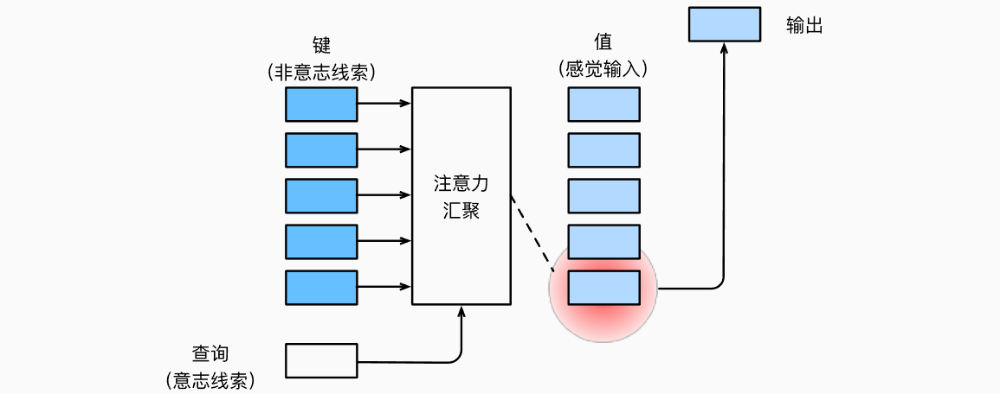
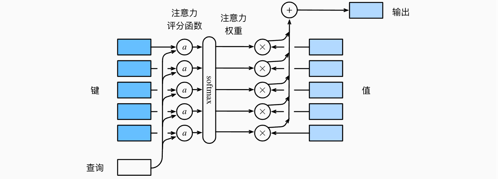
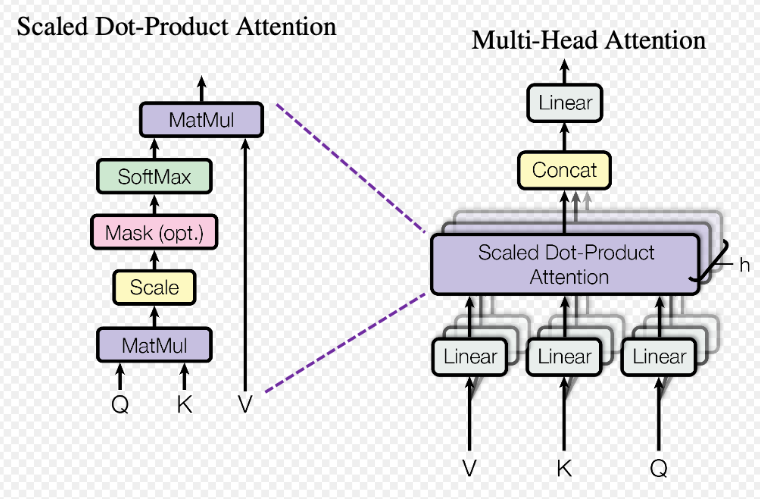
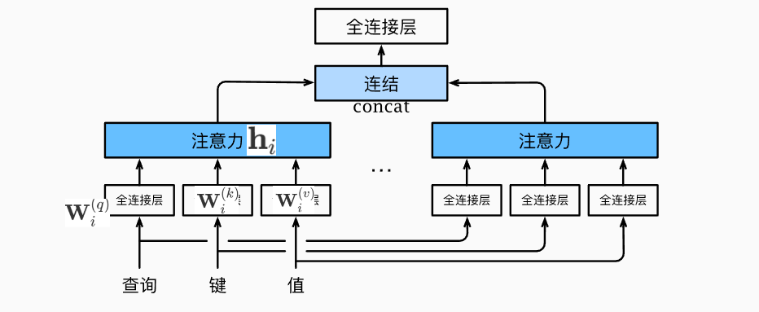
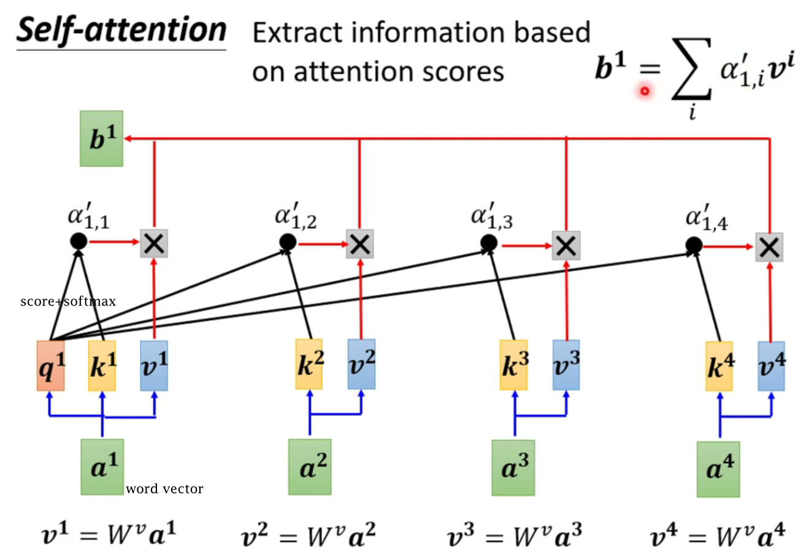

<h1 align='center'> 注意力机制 (attention mechanism)</h1>

*Attention*是一种计算机制, Transformer的核心计算模块就是*Self-Attention(自注意力)*

## 一. 注意力汇聚
人们基于*非自主性提示*和*自主性提示*有选择的引导注意力的焦点.
1. **非自主提示**是来自**环境**中物体的突出性和易见性(醒目的颜色, 尖叫声);
2. **自主性提示**来自**人的主观意识**, 比如在杂乱的环境中, 专注于黑白打印的书本文字.

用神经网络来设计注意力机制的框架的话:
1. 若只有非自主提示, 则可以简单的使用参数化的全连接层, 甚至是非参数化的最大汇聚层或平均汇聚层就能实现
2. 若要包含注意力机制, 简单的全连接层就不行了

### 1. 自主性提示 -- 查询(query)
自主性提示被称为*查询(query)*, 给定查询, *注意力汇聚(attention pooling)* 将查询与接近的*键(key, 代表非自主性提示)* 匹配, 从而将注意力导向到以key相配对的 *值(value, 感官输入)*


### 2. 无参数注意力汇聚
考虑一个回归问题: 给定的成对的"输入-输出"数据集${(x_1, y_1),(x_2, y_2),...,(x_n, y_n)}$, 如何学习出$f$来预测任意的新输入$x$的输出$\hat{y} = f(x)$?

可以使用**加权注意力**, 通过输入$x$和以往输出$x_i$的相关性, 来给相应的$y_i$加权:
$$
f(x) = \sum_{i=1}^{n}\frac{K(x-x_i)}{\sum_{j=1}^n K(x-x_j)} y_i
$$
对于任意查询, 模型在所有键值对注意力权重都**是一个有效的概率分布**.

无参数的注意力汇聚, 只要有足够的数据, 模型确实能够收敛到最有效果

### 3.带参数注意力汇聚
在上述无参数模型中, 加入可学习的参数集
[采用高斯核$K(x-x_i) = \frac{1}{\sqrt{2\pi}} \exp\left(-\frac{(x-x_i)^2}{2}\right)$]:
$$
\begin{aligned}
f(x) &= \sum_{i=1}^n \alpha(x, x_i) y_i \\
&= \sum_{i=1}^n \frac{\exp\left(-\frac{1}{2}\left((x - x_i)w\right)^2\right)}{\sum_{j=1}^n \exp\left(-\frac{1}{2}\left((x - x_j)w\right)^2\right)} y_i \\
&= \sum_{i=1}^n \mathrm{softmax}\left(-\frac{1}{2}\left((x - x_i)w\right)^2\right) y_i.
\end{aligned}
$$

## 二. 注意力评分函数
将注意力汇聚模块进行细分, 可以得到:

有一个查询$q \in R^q$和$m$个"键-值"对$(k_1, v_1),...,(k_m,v_m)$, 其中$k \in R^, v_i \in R^v$, **注意力汇聚函数f**就被表示为值的加权平均:
$$
f(q,(k_1,v_1),...,(k_m,v_m)) = \sum_{i=1}^m \alpha(q, k_i)v_i
$$
其中查询$q$和键$k_i$的注意力权重 (标量) 是通过注意力评分函数$score$将两个向量映射成标量, 在经过softmax运算的得到的:
$$
\alpha(\mathbf{q}, \mathbf{k}_i) = softmax(score(\mathbf{q}, \mathbf{k}_i)) = \frac{\exp(score(\mathbf{q}, \mathbf{k}_i))}{\sum_{j=1}^m \exp(score(\mathbf{q}, \mathbf{k}_j))}
$$
**注意力评分的得分就代表这个$q$和键$k_i$之间的相关性**

### 1. softmax mask -- 指定有效长度
$softmax$操作输出一个概率分布作为注意力权重, 默写情况下, 并非所有的值都应该被纳入到注意力汇聚中, 为了仅将**有意义的词元作为值**来获取注意力汇聚, 可以制定一个$valid length$有效序列长度(即词元的个数), 以便在计算softmax时过滤掉超出指定范围的位置
实现masked-softmax函数, 源码在[attention.masked_softmax()](attention.py)

## 三. 两个注意力模型
### 1. 加性注意力
当**查询和键是不同长度的矢量**时, 可以使用*加性注意力(additive attention)* 作为评分函数, 给定查询$q \in R^q$和键$k \in R^k$, 加性注意力的评分函数为
$$
score(\mathbf{q}, \mathbf{k}) = \mathbf{w}_v^\top \tanh\left(W_q \mathbf{q} + W_k \mathbf{k}\right) \in \mathbb{R}
$$
其中**可学习的参数**是$W_q \in R^{h \times q}$, $W_k \in R^{h \times k}$, 和$w_v \in R^{v}$. 将查询和键连结起来后输入到一个多层感知机(MLP), 感知机包含一个隐藏层, 其隐藏单元数(hidden_size)是一个超参数$h$. 使用$\tanh$作为激活函数, 并且禁用偏置项

### 2. 缩放点积注意力
使用**点积**可以得到计算效率更高的评分函数, 但是点积操作要求**查询和键具有相同的长度**$d$.
从小批量的角度来考虑提高效率, 基于n个查询$\mathbf{Q}$和m个键值$\mathbf{K}$对计算注意力, 其中查询和键的长度为$d$, 值的长度为$v$, 查询$\mathbf{Q} \in R^{n \times d}$, 键$\mathbf{K} \in R^{m \times d}$, 和值$\mathbf{V} \in R^{m \times v}$的 *缩放点积注意力(scaled dot-product attention)* 是:
$$
\begin{aligned}
socre(Q,K) = \frac{QK^\top}{\sqrt{d}} \\
\text{softmax}\left(\frac{QK^\top}{\sqrt{d}}\right)V \in \mathbb{R}^{n \times v}
\end{aligned}
$$

```python
class DotProductAttention(nn.Module):
    """Scaled Dot-product Attention"""
    def __init__(self, dropout, **kwargs):
        super(DotProductAttention, self).__init__(**kwargs)
        self.dropout = nn.Dropout(dropout)

    # query的形状: (batch_size, 查询个数, d)
    # keys的形状: (batch_size, "键值对"个数, d)
    # values的形状: (batch_size, "键值对"个数, 值的维度)
    # valid_lens的形状: (batch_size, ) 或者(batch_size, 查询个数)

    def forward(self, queries, keys, values, valid_lens=None):
        d  = queries.shape[-1]
        # 设置transpose_b=True为了交换keys的最后两个维度(即batch_size里面一个一个转置)
        scores = torch.bmm(queries, keys.tanspose(1, 2))/ math.sqrt(d)
        self.attention_weights = masked_softmax(scores, valid_lens)
        return torch.bmm(self.dropout(self.attention_weights),values)

```

#### (1) 缩放因子--$\sqrt{d}$
1. 如果$d$很小, *additive attentiton*和*dot-product attention*相差不大
2. 如果$d$很大, 点乘的值很大, 如果不做$scaling$, 结果就没有


**[该图片展示了缩放点积注意力流程以及下文的多头注意力]**

## 四. 多头注意力
我们希望模型可以基于多个相同的注意力机制学习到不同的行为, 然后将不同的行为作为知识组合起来.


### 1. 数学模型 
给定查询$\mathbf{q} \in \mathbb{R}^{d_q}$、键$\mathbf{k} \in \mathbb{R}^{d_k}$和值$\mathbf{v} \in \mathbb{R}^{d_v}$，每个*注意力头* $\mathbf{h}_i$（$i = 1, \ldots, h$）的计算方法为：
$$
\mathbf{h}_i = f(\mathbf q \mathbf W_i^{(q)}, \mathbf k \mathbf W_i^{(k)},\mathbf v \mathbf W_i^{(v)}) \in \mathbb R^{1 \times p_v},
$$

其中，相较于一个注意力头, 多头注意力模型**多出的可学习的参数**包括$\mathbf W_i^{(q)}\in\mathbb R^{d_q\times p_q}$、$\mathbf W_i^{(k)}\in\mathbb R^{d_k\times p_k}$和$\mathbf W_i^{(v)}\in\mathbb R^{d_v\times p_v}$，以及代表注意力汇聚的函数$f$, $f$可以是前面的加性注意力机制, 或缩放点积注意力机制

**多头注意力的输出需要经过另一个线性转换**，它对应着$h$个头连结(Concat)后的结果，因此其可学习参数是$\mathbf W_o\in\mathbb R^{h p_v\times p_o}$：
$$
\begin{bmatrix}\mathbf h_1 \dots \mathbf h_h\end{bmatrix} \mathbf W_o  \in \mathbb{R}^{p_o}
$$
基于这种设计，**每个头都可能会关注输入的不同部分**，可以表示比简单加权平均值更复杂的函数。

### 2.Multi-head实现
这里选择**缩放点积注意力**作为每个注意力头. 为了**避免计算代价和参数代价的大幅增长**, 设定$p_q = p_k = p_v = p_0/h$ [实际上是一个单头注意力, 只是把Q, K, V划分(特征维度上)成num_heads个空间并行计算]
```python
class MultiHeadAttention(nn.Module):
    """多头注意力"""
    def __init__(self, key_size, query_size, values_size, num_hiddens,
                 num_heads, dropout, bias=False, **kwargs):
        super(MultiHeadAttention, self).__init__(**kwargs)
        self.num_heads = num_heads
        self.attention = DotProductAttention(dropout) # 使用缩放点积注意力
        self.W_q = nn.Linear(query_size, num_hiddens, bias=bias)
        self.W_k = nn.Linear(key_size, num_hiddens, bias=bias)
        self.W_v = nn.Linear(values_size, num_hiddens, bias=bias)
        self.W_0 = nn.Linear(num_hiddens, num_hiddens, bias=bias)
    
    def forward(self, queries, keys, values, valid_lens):
        # queries, keys, values 的 形状:
        # (batch_size, 查询或者键值对的个数, query_size/key_size/values_size)
        # valid_lens 的形状:
        # (batch_size,) 或(batch_size, 查询的个数)
        # 经过变换后, 输出的queries, keys, values的形状:
        # (batch_size*num_heads, 查询或者键值对的个数, num_hiddens/num_heads)
        queries = transpose_qkv(self.self.W_q(queries), self.num_heads)
        keys = transpose_qkv(self.W_k(keys), self.num_heads)
        values = transpose_qkv(self.W_v(values), self.num_heads)

        if valid_lens is not None:
            # 在轴0, 将第一项(标量或者矢量)复制num_heads次, 
            # 然后如此复制第二项, 然后诸如此类.
            valid_lens = torch.repeat_interleave(
                valid_lens, repeats=self.num_heads, dim=0)

            # output的形状: (batch_size*num_heads, 查询的个数, num_hiddens/num_heads)
            output = self.attention(queries, keys, values, valid_lens)

            # 拼接
            # output_concat的形状为: (batch_size, 查询的个数, num_hiddens)
            output_concat = transpose_output(output,self.num_heads)

            return self.W_o(output_concat)
```

## 五. 自注意力机制
将词元序列输入到注意力汇聚中, **每个查询都会关注其他所有的键值对并生成一个注意力权重**, 这称为**自注意力(self-attention)** 

### 1. 自注意力
给定一个词元序列$x_1, x_2,..., x_n [x_i \in R^d]$, 该序列的自注意力输出长度相同的序列$y_1, y_2,.., y_n$, 其中:
$$
y_i = f(x_i, (x_1, x_1),..., (x_n, x_n)) \in R^d
$$
[自注意力中, $Q, K, V$来自同一输入序列X]



### 2. 自注意力 vs rnn
目标: 将由$n$个$d$维词元组成的序列映射到另一个长度相等的序列
1. 相较于*循环神经网络*的对词元序列的顺序操作, $O(n)$个顺序操作, *卷积神经网络*和*自注意力的计算*只需要$O(1)$个顺序操作, 具有**并行计算**的优势
2. 自注意力的计算, 每个词元都**通过自注意力直接连接到任何其他词元**, 任意的序列位置组合之间的路径为$O(1)$, 能更轻松学习序列中的远距离依赖关系.
3. 自注意力的计算复杂性为$O(n^2d)$(参考[缩放点积注意力](#2-缩放点积注意力)), 因此在很长的序列中计算会很慢

### 3. 位置编码
自注意力为了**并行运算**放弃了**顺序操作**, 为了使用序列中的顺序信息, 通过**在输入**表示添加**位置编码(positional encoding)**来注入位置信息
输入词元序列$X \in R^{n \times d}$, 位置编码使用**形状相同的位置嵌入矩阵** $P \in R^{n \times d}$输出$X + P$, 矩阵第$i$, 第$2j$列和第$2j+1$列上的元素为:
$$
\begin{aligned}
p_{i,2j} = \sin(\frac{i}{10000^{2j/d}})\\
p_{i,2j+1} = \cos(\frac{i}{10000^{2j/d}})
\end{aligned}
$$

```python
class PositionalEncoding(nn.Module):
    """位置编码"""
    def __init__(self, num_hiddens, dropout, max_len=1000):
        super(PositionalEncoding, self).__init__()
        self.dropout = nn.Dropout(dropout)

        self.P = torch.zeros((1, max_len, num_hiddens)) # 维度要和X相同
        X = torch.arange(max_len, dtype=torch.float32.reshape(-1,1)) 
        / torch.pow(10000, 
        torch.arange(0, num_hiddens, 2, dtype=torch.float32) / num_hiddens)
        # 该步骤相当于两层for循环

        self.P[:, :, 0::2] = torch.sin(X)
        self.P[:, :, 1::2] = torch.cos(X)
    
    def forward(self, X):
        X = X + self.P[:, :X.shape[1], :].to(X.device)
        return self.dropout(X)
```
在位置嵌入矩阵$P$中, 行代表词元在序列中的位置, 列代表位置编码的不同维度, **每一行的相邻两列属于一个词元的位置编码的两个维度**

## 六. Attention机制计算过程
Attention 机制计算过程大致可以分成三步:
#### 1. 信息输入
用 \( X = [x_1, x_2, \dots x_n] \) 表示输入权重向量
#### 2. 计算注意力分布 \( \alpha \)
通过评分函数计算分数,softmax计算注意力权重，
\[
\alpha_i = softmax(score(k_i, q)) = softmax(score(x_i, q))
\]
\( \alpha_i \)为注意力概率分布, \( score(x_i, q) \)为注意力评分函数, 常见的有如下几种:
- 加性模型: \( s(x_i, q) = v^T tanh(Wx_i + Uq )\)
- 点积模型: \( s(x_i, q) = x_i^T q \)
- 缩放点积模型: \( s(x_i, q) = x_i^T q / \sqrt{d_k} \)
- 双线性模型: \( s(x_i, q) = x_i^T W q \)

#### 3. 信息加权平均
注意力分布\( \alpha_i \)来解释在上下文查询 \( q_i \) 时，第 \( i \) 个信息受关注程度, 即注意力权重
\[
attention(q, X) = \sum_{i=1}^N \alpha_i V_i
\]