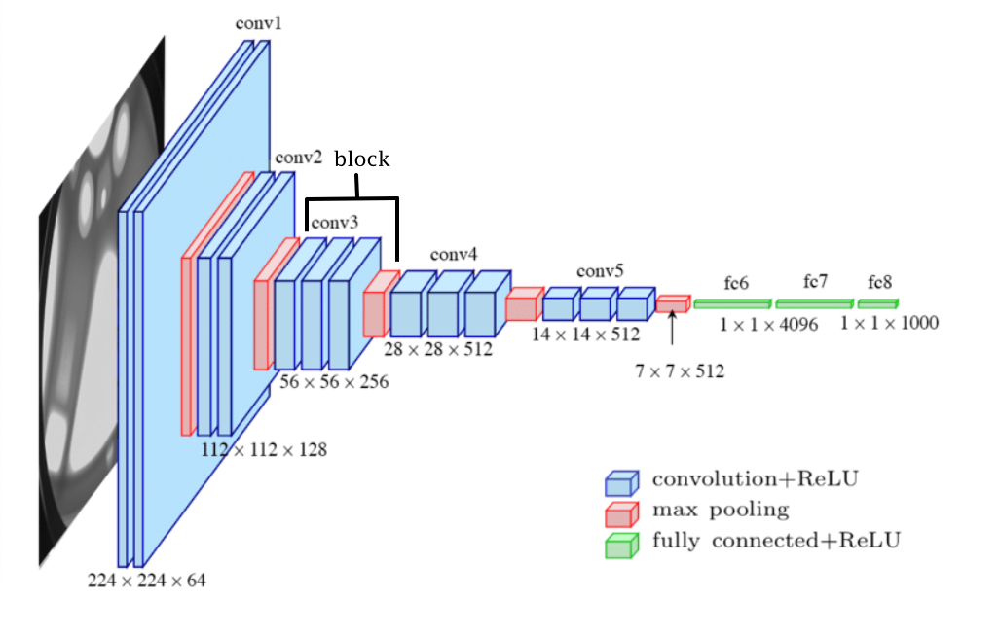
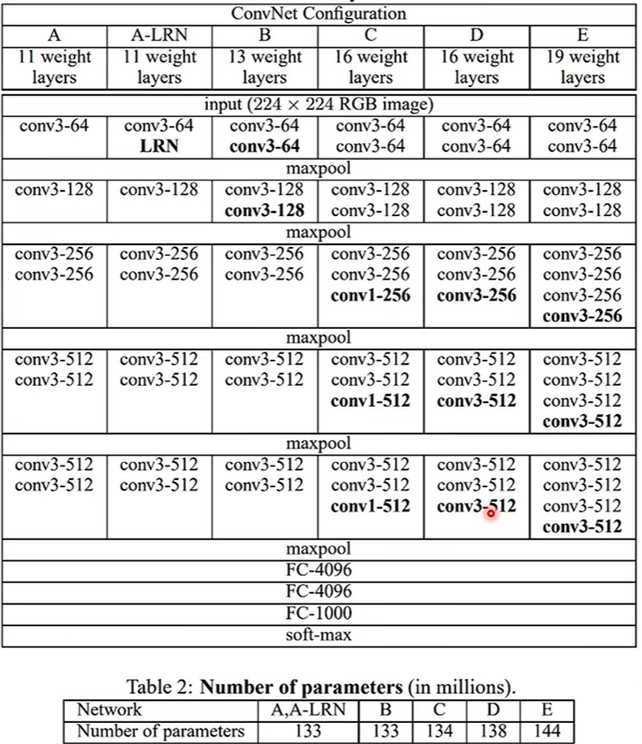

<h2 align='center'>VGG---传统CNN结构的极致</h2>

传统的CNN结构一般为:
```text
Conv → ReLU → Pooling
Conv → ReLU → Pooling
Conv → ReLU → Pooling
...
Flatten
FC
Softmax
```
VGG就是这一结构, **并且, VGG-16和VGG-19**是该结构下所能达到的**最大深度**, 再深训练效果反而不好, 目前没有在这一传统结构上超越VGG的存在


### 一. CNN 视觉模型发展历史
| 时间   | 模型   | 贡献 |
| ---- | --------- | --------- |
| 1998 | LeNet-5   | 最早的 CNN   |
| 2012 | AlexNet   | 深度学习视觉革命  |
| 2014 | VGG       | 深层 + 结构极简 |
| 2014 | GoogLeNet | 多尺度卷积     |
| 2015 | ResNet    | 残差连接      |


### 二. 使用块的网络 (VGG) 
**VGG采用块的形式组成一个神经网络**, 在最初的VGG论文中 [Simonyan and Zisserman, 2014](https://arxiv.org/abs/1409.1556)，作者使用了带有卷积核、填充为1的卷积层，和带有池化窗口、步幅为2（每个块后的分辨率减半）的最大池化层。

```python
import torch
from torch import nn

def vgg_block(num_convs, in_channels, out_channels):
    layer = []
    for _ in range(num_convs): # Conv + ReLU
        layer.append(nn.Conv2d(in_channels, out_channels, kernel_size=3, padding=1))
        layer.append(nn.ReLU())
        in_channels = out_channels

    layer.append(nn.MaxPooling2d(kernel_size=2, stride=2))
    return nn.Sequential(*layers)
```

### 三. VGG11结构

原始VGG网络有**5个卷积块**，其中前两个块各有一个卷积层，后三个块各包含两个卷积层。 第一个模块有64个输出通道，每个后续模块将输出通道数量翻倍，直到该数字达到512。由于该网络使用8个卷积层和3个全连接层，因此它通常被称为VGG-11, 11个weight layers
[**图为VGG16结构**, 不同之处在于每个block的卷积个数]

```python
def vgg(conv_arch):
    conv_blks = []
    in_channels = 1
    # 卷积层部分
    for (num_convs, out_channels) in conv_arch:
        conv_blks.append(vgg_block(num_convs, in_channels, out_channels))
        in_channels = out_channels

    return nn.Sequential(
        *conv_blks, nn.Flatten(),
        # 全连接层部分
        nn.Linear(out_channels * 7 * 7, 4096), nn.ReLU(), nn.Dropout(0.5),
        nn.Linear(4096, 4096), nn.ReLU(), nn.Dropout(0.5),
        nn.Linear(4096, 1000))

conv_arch = ((1, 64), (1, 128), (2, 256), (2, 512), (2, 512)) #该参数用于实现vgg11
# conv_arch_vgg16 = ((2, 64), (2, 128), (3, 256), (3, 512), (3, 512))
net = vgg(conv_arch)
```

### 四. 感受野(Receptive Field, RF)
**定义**: 在某一层的一个神经元所能看到的**输入图像**区域的大小
或者说, 一个feature map的一个值所能反映的输入输入图像的某个区域的大小

#### 感受野增长直觉
浅层(小的RF):
```text
检测边缘
角点
纹理
```

中层:
```text
眼睛
轮子
窗户
```

深层(大的感受野):
```text
整张脸
整辆车
```

### 五. 3x3卷积核的作用
> VGG的关键思想是: **用多个小卷积和代替一个大卷积核**

以一个 5x5 的图像为例, 对比不同的卷积核使用:
1. 使用3x3卷积核

需要使用**两层3x3的卷积核**来实现5x5的感受野
2. 使用5x5卷积核

**一层**便能直接将5x5大小的图像反应到一个feature map的一个值上去, 实现了5x5的感受野

#### 1. 参数量少
假设输入通道数为C, 输出通道数为OC, 要实现5x5的RF:
- 两层3x3卷积核的参数量是:
`2 x (C x 3 x 3) x OC = 18*C*OC`
- 一层5x5卷积核的参数量是:
`1 x (C x 5 x 5) x OC = 25*C*OC`

由此可见, 使用多个卷积核代替大卷积核实现相同的感受野时, 所需的参数量更少. 若是用三层 3x3 kernel代替一层 7x7 kernel能节省更多的参数量

#### 2. 增加非线性
vgg每个block的卷积层都是`Conv -> ReLU`的组合
- 一个 5x5 卷积:
`Conv5 -> ReLU`
- 两个 3x3 卷积:
`Conv3 -> ReLU -> Conv3 -> ReLU`

小卷积核实现更多的层数, **更多的非线性函数**, 模型的表达能力更强[非线性网络更能逼近复杂函数, 而线性是可以合并的]

### 六. 各种vgg的参数
