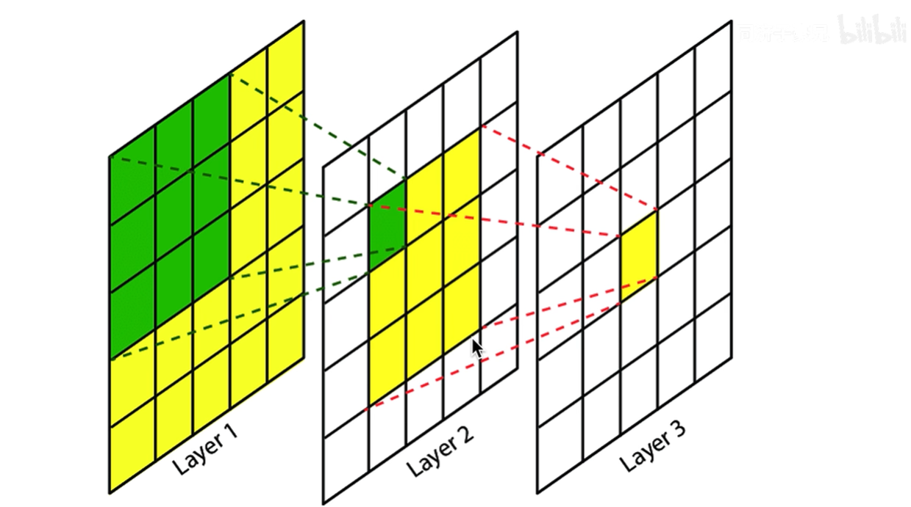
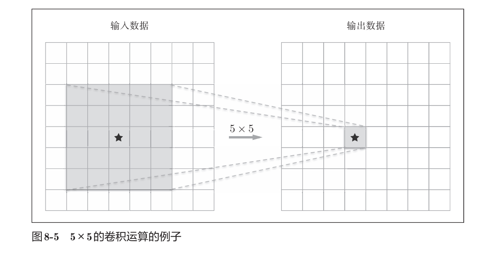
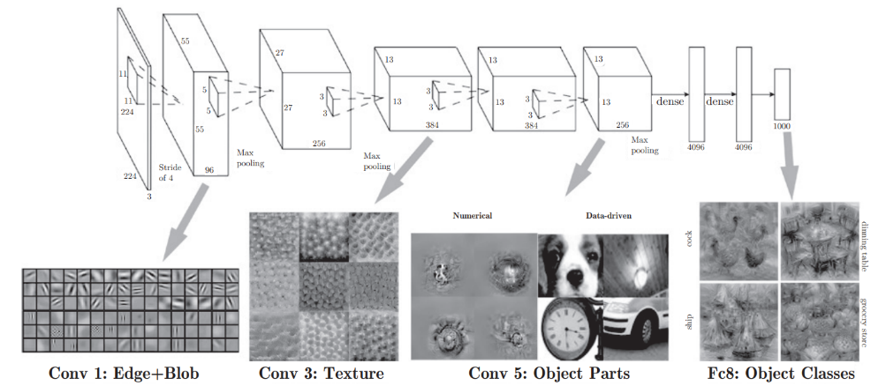
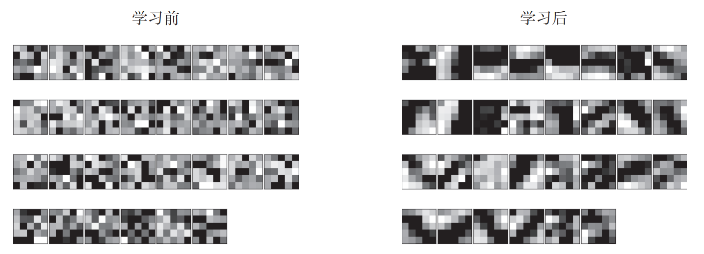
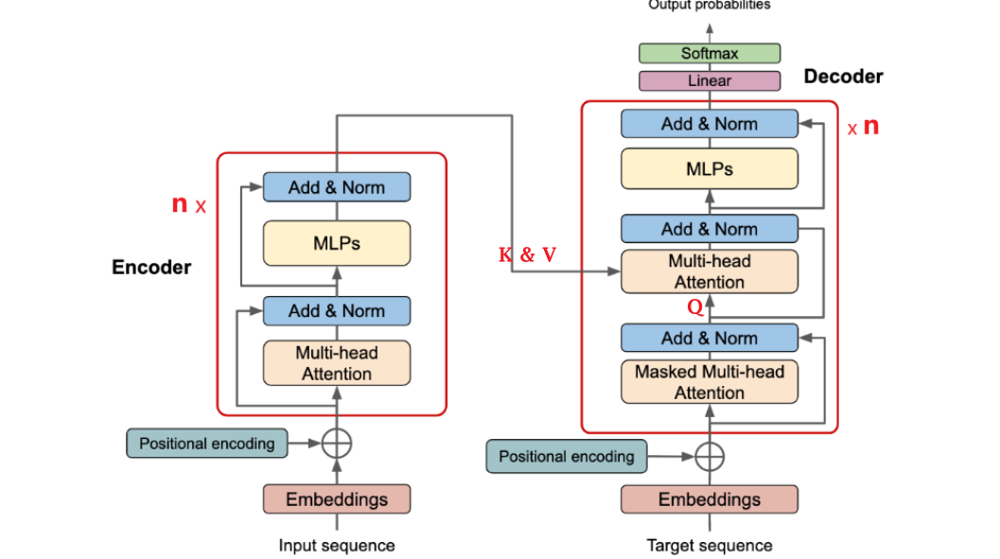

<h2 align='center'>关于DL经典模型的问题思考<h2>

### 一. VGG: `3x3`卷积核作用; 五个`block`作用 

#### 1. 为什么要用`3x3`的卷积核 
> VGG的一个关键思想是: **用多个小卷积和代替一个大卷积核**

以一个 5x5 的图像为例, 对比不同的卷积核使用:
1. 使用3x3卷积核

需要使用**两层3x3的卷积核**来实现5x5的感受野
2. 使用5x5卷积核

**一层**便能直接将5x5大小的图像反应到一个feature map的一个值上去, 实现了5x5的感受野

##### 1. 参数量少
假设输入通道数为C, 输出通道数为OC, 要实现5x5的RF:
- 两层3x3卷积核的参数量是:
`2 x (C x 3 x 3) x OC = 18*C*OC`
- 一层5x5卷积核的参数量是:
`1 x (C x 5 x 5) x OC = 25*C*OC`

由此可见, 使用多个卷积核代替大卷积核实现相同的感受野时, 所需的参数量更少. 若是用三层 3x3 kernel代替一层 7x7 kernel能节省更多的参数量

##### 2. 增加非线性
vgg每个block的卷积层都是`Conv -> ReLU`的组合
- 一个 5x5 卷积:
`Conv5 -> ReLU`
- 两个 3x3 卷积:
`Conv3 -> ReLU -> Conv3 -> ReLU`

小卷积核实现更多的层数, **更多的非线性函数**, 模型的表达能力更强 (非线性网络更能逼近复杂函数, 而线性是可以合并的.)

#### 2. 为什么设置五个`block`
> 5 个`block`的目的是逐步扩大感受野, 逐层提取更抽象的视觉的特征, 同时逐步降低空间分辨率

##### 1. 基于分层结构的信息提取
根据深度学习的可视化相关研究, 随着层次加深, **隐藏层所能提取的信息就越抽象**
比如一开始对简单的边缘有相应, 接下来层可能对纹理有响应, 在后面的层对更加复杂的物体部件有响应.

VGG的5个`block`能够逐层提取到越来越高级的特征, 慢慢获得更加抽象的语义

##### 2. 
经过五个block的过程中, 图像尺寸和通道数变化:
```text
input: [1, 224, 224]
blk1:  [64, 112, 112]
blk2:  [128, 56, 56]
blk3:  [256, 28, 28]
blk4:  [512, 14, 14]
blk5:  [512, 7, 7]
```
每经过一个block, **feature map的分辨率/尺寸就减半(`Maxpolling`), 通道数就翻倍(`Conv.out_channel`)**

1. **通道数的增加**
通道数即使就是**不同特征检测器的数量**, 不同的卷积核有不同的特征检测

早期的简单层, 只需要检测**特征, 角, 简单纹理**等特征, 不需要太多的卷积核, 但到了后面, 就需要**组合一些简单特征**去检测更复杂的特征类型, 因此经过每个blk的卷积层, 卷积核/输出通道数就要更多 

2. **分辨率的降低**
高分辨率意味着**空间位置细节多**
每个block都通过最大层池化来逐步降低分辨率, 一方面这样能够减少计算量, 另一方面, 分辨率的逐步减小实际上在**逐步的扩大感受野**, 到后面, 一个神经元就能看到更大的图像区域, 提取到更高级的特征.

---

### 二. ResNet: 残差连接的作用
背景: **网络退化现象是指**: 理论上来说, 更深的网络模型表现力更好, 然而实际研究表示, 更深的网络反而表现力下降


### 1. 残差学习
在**深度**网络中, 很多层应该做**恒等映射(identity mapping)**: $H(x) \approx x$
**传统的网络(如 VGG)** 是在直接拟合完整函数$H(x)$, ,而在ResNet中, 网络把需要拟合的函数变成:
$$
H(x) = x + F(x) \\
(其中: F(x) = H(x) - x)
$$
这里的x可以视为**前面的较浅较小网络的成果**
残差学习并不是直接拟合$H(x) \approx x$, 而是拟合残差$F(x) \approx 0$

> 对于深度神经网络, 如果我们能将新添加的层训练成**恒等映射(identity function)$H(x)=x$**, 新模型和原模型将同样有效(即使残差没有学到东西). 同时, 由于新模型可能得出 **更优的解(使用残差进行微调)** 来拟合训练数据集，因此添加层似乎更容易降低训练误差。


### 2.残差连接能够让网络更容易学习恒等映射
普通的网络需要学$H(x) = x$, 残差网络只需要$F(x) = 0$的拟合, 这样使得更深的网络也能容易的学习到恒等映射 

---

### 三. RNN: 为什么用RNN; 和CNN的不同

#### 1. 为什么要用循环神经网络RNN
现实生活中, 更多问题都是序列问题: 语言模型(单词序列), 机器翻译(seq2seq), 语音识别(声音时间序列), 股票预测(时间序列)
1. **对记忆的要求**
**MLP**和**CNN**, 这些网络工作时, 只会接收一个输入, 然后经过隐藏层, 得到特定的输出, 基本就是在拟合函数$y=f(x)$, 他们所处理的输入之间是没有关系的, 只会一个一个的处理输入, 之前的某个输入不会对现在输入的处理产生影响
但是对于序列问题而言, 序列**前后数据之间的关系是密切的**(上下文, 视频前后帧, **词性标注**问题, 时序信息), 为了解决一些这样类似的问题, 能够更好的处理序列的信息, RNN就诞生了。

>假设长度为$T$的文本序列中的词元依次为$x_1, x_2, ..., x_T$, $x_t (1 \leq t \leq T)$, $x_t$可以认为是**文本序列在时间步$t$处的观测或标签**, 在给定这样的文本序列时, *语言模型*(LM) 的目标就是**估计**序列的联合概率:
$$
P(x_1, x_2, ..., x_T)
$$

2. **非固定的输入长度**
普通的CNN, MLP处理的都是**固定长度的输入**, 但对于序列数据尤其是时间序列而言, 输入长度是很不固定的, 这就使得原有的网络无法有效的处理

#### 2. RNN vs CNN
1. 处理数据形式:
CNN主要用于处理空间的二维的图像数据;
RNN则利用其循环结构处理时间序列以及其他的依赖序列和记忆的数据
2. 信息处理方式:
CNN是高度的**空间并行计算**, 依次就能处理一整个feature map; 
RNN是**时间步**上的顺序计算, 顺序操作复杂度高, 每层的状态要依赖之前时刻的状态
3. 记忆
CNN只是一个一个互不干扰处理;
RNN则是能记住上下文

---

### 四. LSTM: 和RNN的不同
#### 1. 简单rnn
简单的rnn在应用中会有许多缺陷:
- 不支持**长期依赖(Long-term Dependeny)**, `The animal didn't cross the street because it was too tired.`中的`it`指的是`animal`, 但是由于相距过长 (时间步较长), *梯度消失*使得简单rnn很难记住这个关系
- **序列数据的一些词元没有观测值**(和目标无关), rnn无法跳过. 对网页内容情感分析时, 一些辅助HTML代码与网页内容传达的情绪无关, 能否**有一些机制来跳过隐状态表示中的此类词元**
- ...

综上, 引入**门控机制**, 网络能够通过专门的门控来决定隐状态的更新和重置(信息的忘记与保留). 例如, 如果第一个词元非常重要, 模型将学会在第一次观测之后不更新隐状态. 同样, 模型也可以学会跳过不相关的临时观测. 最后, 模型还将学会在需要的时候重置隐状态。

#### 2. 长短期记忆模型LSTM 
LSTM引入了*记忆元(memory cell)*, 记忆元是隐状态的一种特殊类型
为了控制记忆元, 需要很多门: 
- *输出门(output gate)* 从单元中输出记忆元的tanh的门控版本;
- *遗忘门(forget gate)* 用于重置单元的内容; 
- *输入门(input gate)* 用于控制写入多少新数据

**相较于简单rnn, LSTM有:**
1. 门控机制, 更能够控制记忆, 有能力去保存长期的信息
2. 更高的梯度传播能力, LSTM的梯度连乘项不会像rnn那样很快就变得很大或很小,它的变化基本很稳定, 能缓解梯度消失的缺陷

---

### 五. 注意力机制和Transformer
注意力机制可以理解是一种计算方法或者计算机制, 而transformer就是基于注意力机制(多头 自注意力 )构建的一个完整的模型架构

#### 1. 注意力机制
注意力机制是由 *人类引导注意力的自主性提示* 这一启示中提出, 他涉及注意力评分函数, 不同的注意力机制等成分, 他的基本点就是**注意力权重的计算**
$$
f(q,(k_1,v_1),...,(k_m,v_m)) = \sum_{i=1}^m \alpha(q, k_i)v_i
$$
其中查询$q$和键$k_i$的**注意力权重 (标量) **是通过注意力评分函数$score$将两个向量映射成标量, 在经过softmax运算的得到的:
$$
\alpha(\mathbf{q}, \mathbf{k}_i) = softmax(score(\mathbf{q}, \mathbf{k}_i)) = \frac{\exp(score(\mathbf{q}, \mathbf{k}_i))}{\sum_{j=1}^m \exp(score(\mathbf{q}, \mathbf{k}_j))}
$$

#### 2. `Transformer`模型架构
自注意力具有**并行计算**和**最短的最大路径长度**这两个优势, 因此使用自注意力来设计深度架构是很有吸引力的
**Transfrom模型**[Vaswani et al.,2017]完全基于注意力机制, 没有任何的Conv和rnn层
Transformer最初应用于在文本数据上的Seq2Seq学习, 但现在已经推广到各种现代的深度学习中, 例如语言, 视觉, 语音和强化学习领域.

##### Transformer 模型


###### 1. 编码器
编码器由多个相同的层叠加而成, 每个层都有两个子层(sublayer),
1. 第一个子层是**多头自注意力**汇聚
2. 第二个子层是**基于位置的前馈网络**

计算**编码器**的自注意力时, query, key和values都来自前一个编码器层的输出.

- 关于ADD&Norm
对于序列中任何位置的任何输入$x \in R^d$, 都满足$\text{sublayer}(x) \in R^d$, 以便**残差连接**满足$x + \text{sublayer}(x) \in R^d$

在残差连接的加法Add计算后, 紧接着就是**应用层规范化(layer normalization)**.

###### 2. 解码器
解码器也是有多个相同的层叠加而成, 并且层中使用了残差连接和层规范化
每个解码器层除了两个子层 *Multi-head和FFN* 外, 还在这两个子层之间插入了第三个子层, 称为**编码器-解码器注意力(encoder-decoder attention)** 层
1. 在*编码器-解码器注意力*中, **查询来自前一个解码层的输出, 而键和值来自整个编码器的输出**
2. 在*解码器自注意力*中, 查询和键和值都来自**上一个解码器层的输出**

**掩蔽**:解码器中的每个位置只能考虑该位置之前的所有位置, 这种**掩蔽(masked)** 注意力保留了*自回归(auto-regressive)* 属性, 确保预测**仅依赖于已生成的输出词元**